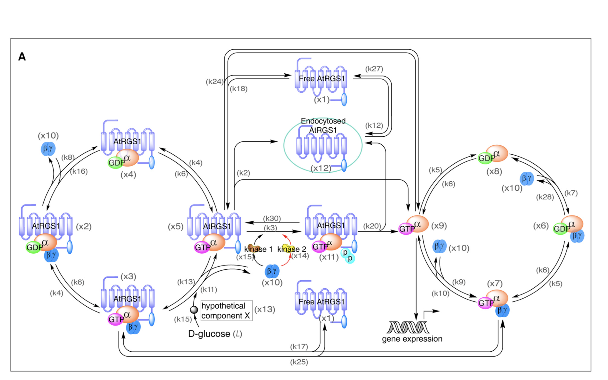

# Light-Detector-Modeling

MATLAB modeling based on Liao et al. shadow detector paper

The G-protein glucose induced pathway involving AtRGS1 and trimeric G protein

## References
1. Liao et al. (2017). A shadow detector for photosynthesis efficiency. J Theor Biol. 2017 Feb 7;414:231-244.
2. Fu et al. (2014). Reciprocal Encoding of Signal Intensity and Duration in a Glucose-Sensing Circuit. Cell 156, 1084–1095.

## File structure
1. light_shadow_detector.m

   The standard imlementation to replicate images from the Liao paper

2. light_shadow_detector_perterbed.m

   Based on light_shadow_detector.m, changing the light-glucose relationship by varying sensitivity and considering glucose homeostasis

3. Images

   Reproducing images in the Liao et al. paper
   
## Visualization of the model

